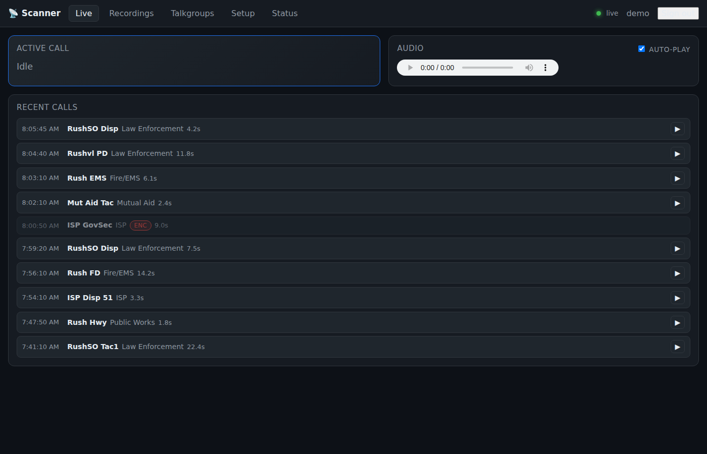
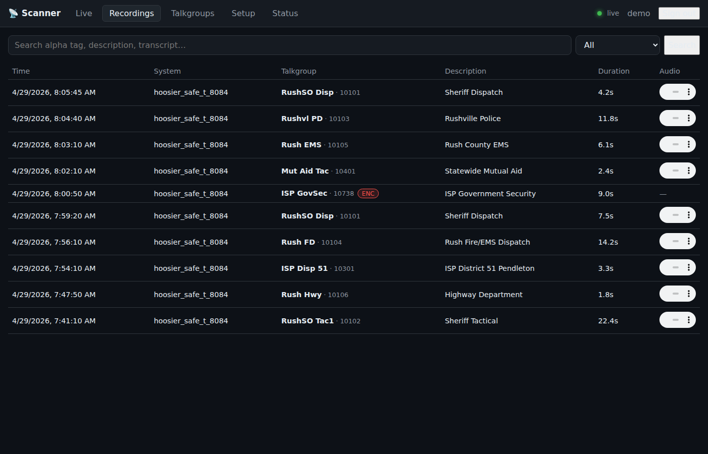
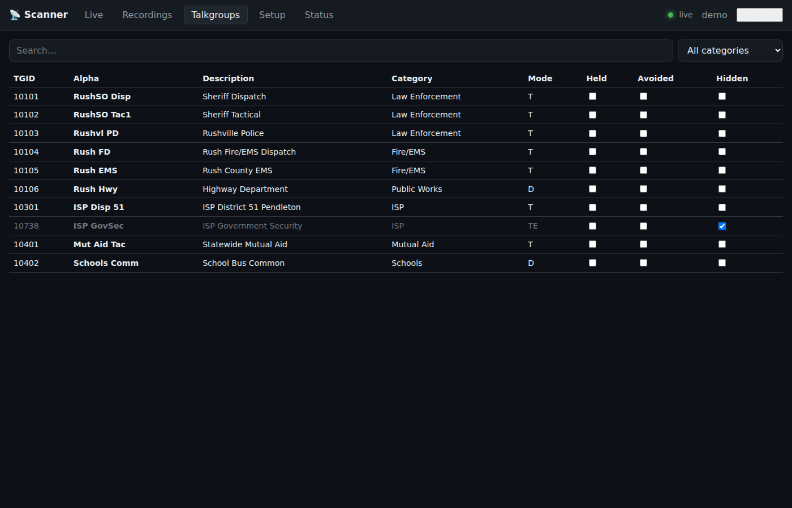
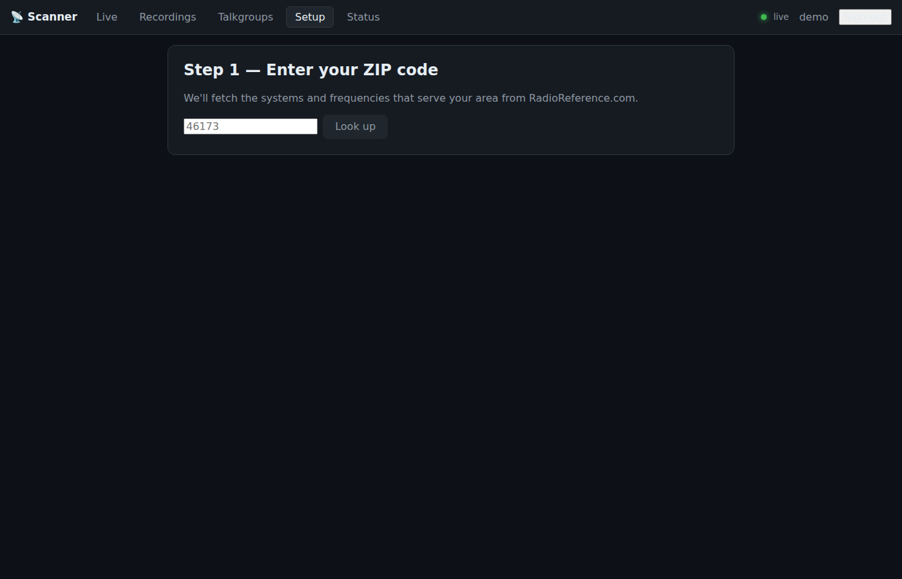
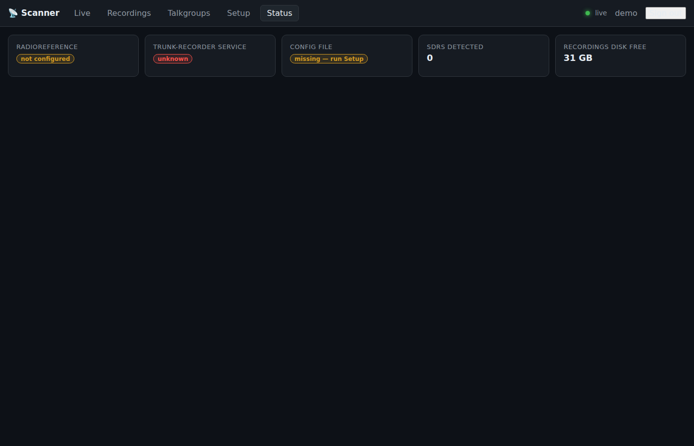
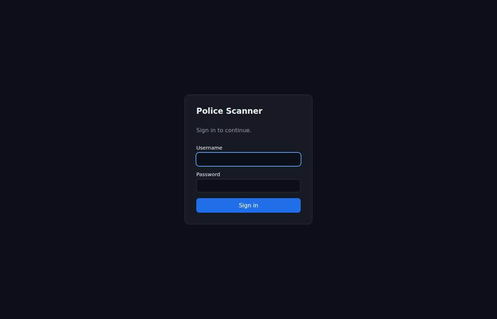

# Police Scanner — Raspberry Pi 5 + 3× RTL-SDR

A self-hosted multi-SDR public-safety scanner built to beat a Uniden SDS100 on
usability. Type a ZIP code on first run and the importer pulls every relevant
trunked system, site, talkgroup, and conventional VHF/UHF channel straight from
[RadioReference.com](https://www.radioreference.com), plans the SDR allocation,
writes the [trunk-recorder](https://github.com/robotastic/trunk-recorder) config,
and starts decoding. The whole thing is driven from a custom Vue 3 web UI you
can pull up from any device on your LAN — or expose to the public internet
behind nginx + Let's Encrypt.



## Why build this when a Uniden SDS100 exists?

| Feature                                 | Uniden SDS100/SDS200 | This project           |
|-----------------------------------------|----------------------|------------------------|
| P25 Phase 1 + Phase 2                   | ✅                   | ✅ (via trunk-recorder) |
| Conventional FM, P25, DMR              | ✅                   | ✅                     |
| NXDN, ProVoice                          | ✅                   | ⚠️ DSDPlus / SDRTrunk sidecar (planned) |
| **Record every call, indefinitely**     | ❌ (small replay buf)| ✅                     |
| **Web UI accessible from any device**   | ❌ (tethered)        | ✅                     |
| **Multiple simultaneous listeners**     | ❌                   | ✅                     |
| **Full-text searchable archive**        | ❌                   | ✅                     |
| **Voice transcription (Whisper)**       | ❌                   | ✅ (optional)          |
| Hold / avoid / categorize talkgroups    | ✅                   | ✅                     |
| Hide encrypted talkgroups               | ✅                   | ✅                     |
| GPS-driven location-aware scanning      | ✅                   | ❌ (one site at a time)|
| Survives Pi reboot                      | n/a                  | ✅ (systemd units)     |
| Cost (~)                                | $700                 | ~$200                  |

The handheld will always win for "I want to listen in the car." This system
wins everywhere else.

## Screenshots

### Live view
Active call up top, last 25 calls below with one-click playback. Encrypted
talkgroups are dimmed and not auto-played. The top-right shows live WebSocket
connection status.


### Recordings library
Search alpha tags, descriptions, or Whisper transcripts. Filter by
clear/encrypted. Inline HTML5 audio for every recording.



### Talkgroups
Hold (force-listen), Avoid (skip), Hidden flags persist across re-imports of
the RadioReference data. Filter by category or free text.



### Setup wizard
Type ZIP → preview systems and talkgroups → choose categories → save. The
wizard validates whether the chosen site fits your SDR count before writing
the trunk-recorder config.



### Status
Real-time check on the radio backend, SDR enumeration (with per-dongle
serials), trunk-recorder service health, and disk free.



### Login
Argon2id-backed login, server-side sessions, lockout after 5 failed attempts.



## Architecture

```
┌─ Browser (LAN or WAN through nginx) ─────────────────────┐
│  Vue 3 (no build, vendored at /static/js/vendor/)        │
│  WebSocket for live events · HTML5 audio for playback   │
└──────────────────────────┬───────────────────────────────┘
                           │ HTTPS (nginx → :8080 loopback)
┌──────────────────────────▼───────────────────────────────┐
│  FastAPI / uvicorn — single Python process               │
│  • RadioReference SOAP client (zeep)                     │
│  • SDR planner + trunk-recorder config generator         │
│  • argon2id auth, server-side sessions, CSRF, rate-limit │
│  • SQLite (WAL) for users, talkgroups, calls, audit log  │
│  • WebSocket hub fed by MQTT subscriber                  │
│  • /api/tr/upload (loopback only) ingests audio per call │
└────────▲─────────────────────────┬───────────────────────┘
         │ MQTT (loopback Mosquitto) │ uploadScript hook
┌────────┴─────────────────────────┴───────────────────────┐
│  trunk-recorder (C++ / GNU Radio) — separate systemd unit │
│  Plugins: libmqtt_status_plugin.so + uploadhook wrapper   │
└──────────────────────────┬───────────────────────────────┘
                           │ librtlsdr-blog (built from source)
            ┌──────────────┼──────────────┐
            ▼              ▼              ▼
        SDR-CTL        SDR-VOICE      SDR-CONV
       (00000101)     (00000102)     (00000103)
                Powered USB 3 hub
                          │
                  Raspberry Pi 5
```

Two systemd units, totally decoupled:
- **`police-scanner.service`** — the FastAPI web app and ingest pipeline.
- **`trunk-recorder.service`** — the radio decoder. Restarts only when the
  config it reads (rendered by the wizard) actually exists.

## Hardware

| Item                           | Notes                                                                  |
|--------------------------------|------------------------------------------------------------------------|
| Raspberry Pi 5 (4 or 8 GB)     | 8 GB recommended if you'll enable Whisper. Active Cooler required.    |
| 3× **RTL-SDR Blog v4**         | TCXO + R828D. Flash unique serials with `scripts/flash-sdr-serials.sh`.|
| Powered USB 3 hub              | **Don't** power dongles from the Pi directly — voltage sag = drops.   |
| 700/800 MHz public-safety antenna | Tuned ¼-wave ground-plane outperforms a wideband discone.          |
| LMR-240 or LMR-400 coax        | RG-58 is OK only for runs ≤ 3 m.                                       |
| 64 GB+ microSD or USB SSD      | A24h × 32 kbps Opus = ~340 MB/day worst-case; sized for retention.    |

## Quick install (Raspberry Pi OS Bookworm 64-bit)

```bash
git clone https://github.com/<you>/Rtl-sdr-scanner.git
cd Rtl-sdr-scanner
sudo ./scripts/install-pi.sh
```

The installer (idempotent — safe to rerun):
1. Installs apt deps, GNU Radio, Mosquitto, nginx, certbot.
2. Builds **`librtlsdr-blog`** from source (mainline Osmocom is too old for v4).
3. Blacklists `dvb_usb_rtl28xxu` so the kernel doesn't fight us for the dongles.
4. Builds **trunk-recorder** + the **MQTT status plugin** from source.
5. Creates a `scanner` system user, `/var/lib/police-scanner/`, and the
   `uploadhook` wrapper.
6. Drops in two systemd units (sandboxed: `ProtectSystem=strict`, `NoNewPrivileges`,
   `SystemCallFilter`, etc.).
7. Writes `/etc/police-scanner/env` with a freshly-generated 64-byte secret.

Then, one-time SDR setup (do this once with each dongle plugged in alone):

```bash
sudo ./scripts/flash-sdr-serials.sh
```

This writes deterministic serials `00000101 / 00000102 / 00000103` so the
config can name them by role rather than USB port.

## First-run

1. Edit `/etc/police-scanner/env`:
   ```dotenv
   RR_APP_KEY=<from radioreference.com/account/api>
   RR_USERNAME=<your RR username>
   RR_PASSWORD=<your RR password>
   SCANNER_ADMIN_PASSWORD=<pick a strong one>
   SCANNER_PUBLIC_URL=https://scanner.example.com   # or http://raspberrypi.local:8080
   ```
2. Start the web app: `sudo systemctl enable --now police-scanner.service`
3. Browse to the URL → log in as `admin` with the password you set.
4. Click **Setup**, type your ZIP code, look up.
5. Pick the trunked system + site, check the categories you care about, leave
   "Hide encrypted" on.
6. **Save** — the wizard writes `/var/lib/police-scanner/trunk-recorder/config.json`
   and the per-system talkgroup CSVs.
7. Start the radio backend: `sudo systemctl enable --now trunk-recorder.service`
8. Switch to **Live** — calls will start appearing.

## Public-facing deploy

The service is hardened for direct internet exposure. The recommended topology
is **nginx → loopback FastAPI**:

```bash
sudo cp nginx/police-scanner.conf /etc/nginx/sites-available/police-scanner
sudo ln -s ../sites-available/police-scanner /etc/nginx/sites-enabled/
sudo certbot --nginx -d scanner.example.com
```

In `/etc/police-scanner/env`:
```dotenv
SCANNER_HOST=127.0.0.1
SCANNER_PORT=8080
SCANNER_PUBLIC_URL=https://scanner.example.com
SCANNER_TRUST_PROXY=true
SCANNER_IP_ALLOWLIST=                          # optional: 192.168.0.0/16,1.2.3.4/32
```

What you get out of the box:
- TLS via Let's Encrypt; secure-cookie + HSTS toggle automatically.
- nginx blocks `/api/tr/*` so the trunk-recorder ingest can never be reached
  from the internet (also enforced in code as loopback-only + shared secret).
- argon2id passwords (`time_cost=3`, `memory_cost=64 MiB`).
- Server-side sessions; the cookie holds a random 32-byte token, the DB stores
  only its SHA-256.
- 5-failure / 15-minute lockout per username; sliding-window IP rate limits
  (10 logins/min, 120 API hits/min).
- Strict CSP (`script-src 'self' 'unsafe-eval'` only — the eval is unavoidable
  for runtime-template Vue without a build step), CSRF double-submit cookie,
  secure headers.
- systemd hardening: `ProtectSystem=strict`, `PrivateTmp`, `RestrictNamespaces`,
  `MemoryDenyWriteExecute`, `SystemCallFilter=@system-service`.

## SDR allocation logic

A single RTL-SDR captures ~2 MHz of usable spectrum at 2.4 Msps. Trunked-system
sites can span more than that — Project Hoosier SAFE-T's Knightstown cell, for
example, spans 4.86 MHz between its lowest and highest voice frequencies. The
planner uses a **greedy interval cover**: it walks the sorted frequency list
and opens a new SDR window whenever the next frequency is more than 2 MHz from
the current cluster's start. If more SDRs are needed than allocated, it fails
loud with an actionable message.

```
Frequencies:  769.81  770.50  772.00  773.00  774.68 MHz
              [───── SDR-CTL ─────]   [── SDR-VOICE ──]
              center 771.0 MHz       center 773.84 MHz
```

The third SDR (`SDR-CONV`) is reserved for conventional VHF/UHF. Its center is
chosen by an O(n) sliding-window over all the area's conventional frequencies,
maximizing the count covered. Anything outside that 2 MHz window is reported
back to the UI as "uncovered."

## Configuration reference

Every setting reads from `/etc/police-scanner/env` (which is `0640
root:scanner`). See [`.env.example`](./.env.example) for the complete list.
Highlights:

| Var                          | Purpose                                                     |
|------------------------------|-------------------------------------------------------------|
| `SCANNER_SECRET_KEY`         | Cookie/CSRF signing. ≥ 32 chars; auto-generated by installer.|
| `SCANNER_ADMIN_PASSWORD`     | Used only on first start to bootstrap the admin user.       |
| `SCANNER_TRUST_PROXY`        | Honor `X-Forwarded-For` (only behind nginx).                |
| `SCANNER_IP_ALLOWLIST`       | Comma CIDRs; empty = open.                                  |
| `RR_APP_KEY` / `_USERNAME` / `_PASSWORD` | RadioReference SOAP credentials.                |
| `RECORDING_RETENTION_DAYS`   | Auto-sweep older recordings. `0` = keep forever.            |
| `WHISPER_MODEL_PATH`         | Set to a `ggml-*.bin` to enable transcription.             |

## Operations

```bash
# Status
systemctl status police-scanner trunk-recorder
journalctl -u police-scanner -f
journalctl -u trunk-recorder -f

# Edit config from the web UI, then…
sudo systemctl restart trunk-recorder

# Disk usage
du -sh /var/lib/police-scanner/recordings/

# Audit log (every login attempt, lockout, setup change)
sqlite3 /var/lib/police-scanner/db.sqlite \
  'SELECT at, actor, ip, action, detail FROM auditevent ORDER BY at DESC LIMIT 50'
```

## Tests

```bash
.venv/bin/python -m pytest server/tests/ -q
```

23 tests, ~1 s. Coverage:
- SDR planner edge cases (narrow site, wide site, dense site exceeding budget,
  far-apart pair fitting, conventional sliding window, atomic config write,
  CSV escaping)
- RadioReference response normalization
- Argon2id round-trip, token hashing, path-traversal guards, ZIP/serial regex
- **Live ASGI integration**: login, `/me`, wrong-password 401, unknown-user 401,
  lockout after 5 failures, protected-route 401, security-headers presence

## Project layout

```
Rtl-sdr-scanner/
├── scripts/
│   ├── install-pi.sh           # Idempotent Pi installer
│   ├── flash-sdr-serials.sh    # rtl_eeprom helper
│   ├── uploadhook-wrapper.sh   # trunk-recorder per-call hook
│   └── generate_screenshots.py # Reproducible README screenshot harness
├── systemd/                    # Sandboxed unit files
├── nginx/police-scanner.conf   # TLS reverse-proxy reference
├── docs/screenshots/           # README images
├── server/police_scanner/
│   ├── main.py                 # FastAPI app + lifespan
│   ├── settings.py             # Pydantic-validated env
│   ├── models.py               # SQLModel schema
│   ├── db.py                   # Async SQLite + WAL
│   ├── auth.py                 # argon2id + sessions
│   ├── security.py             # CSP/CSRF/IP allowlist middleware
│   ├── rate_limit.py           # Sliding-window per-IP buckets
│   ├── radioreference.py       # SOAP client (zeep)
│   ├── tr_config.py            # SDR planner + config generator
│   ├── mqtt_bridge.py          # paho → WebSocket
│   ├── ws_hub.py               # WebSocket fanout
│   ├── retention.py            # Recording retention sweep
│   ├── uploadhook.py           # POST audio to /api/tr/upload
│   ├── routes/                 # auth, setup, calls, talkgroups, status, tr_ingest
│   ├── templates/              # Jinja2 (login + SPA shell)
│   └── static/                 # Vue 3 (vendored), CSS, view components
└── server/tests/               # Unit + integration tests
```

## Glossary

| Term      | Meaning                                                                       |
|-----------|-------------------------------------------------------------------------------|
| **P25**   | APCO Project 25, the digital voice standard used by most US public safety.    |
| **Phase 1 / Phase 2** | FDMA 12.5 kHz vs TDMA 6.25 kHz channels.                          |
| **Trunked system** | Many talkgroups share a small pool of voice frequencies; a control channel tells radios where to listen. |
| **Control channel** | The frequency that broadcasts assignments. Scanner must follow it.   |
| **Talkgroup (TGID)** | Logical group; equivalent to a "channel" on conventional radio.     |
| **Simulcast** | Same content on multiple towers at once for wider coverage.              |
| **WACN / SysID / NAC** | P25 network identifiers; helps differentiate adjacent systems.    |
| **RFSS** | RF Sub-System; a subdivision of a P25 trunked system, contains sites.         |
| **Encrypted (E / DE)** | Audio scrambled with AES/DES; cannot be decoded without keys.    |
| **Conventional** | Each channel is a single frequency, not pooled. Most rural fire/EMS.      |

## Sources & credits

- [trunk-recorder](https://github.com/robotastic/trunk-recorder) — the radio backend
- [trunk-recorder MQTT plugin](https://github.com/TrunkRecorder/trunk-recorder-mqtt-status)
- [librtlsdr-blog](https://github.com/rtlsdrblog/rtl-sdr-blog) — RTL-SDR v4 driver fork
- [RadioReference Web Service v3.1](https://wiki.radioreference.com/index.php/RadioReference.com_Web_Service3.1)
- [Indiana Project Hoosier SAFE-T](https://www.radioreference.com/db/sid/8084) (test target)

## License

MIT.
